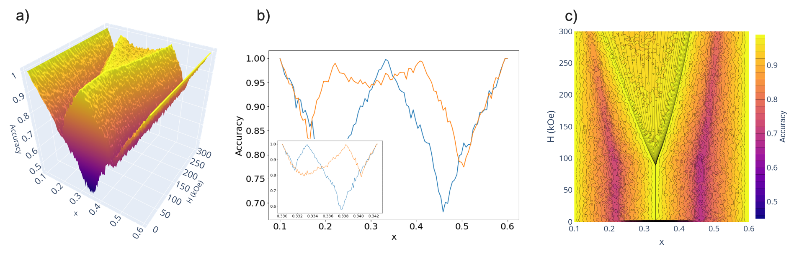

# Learning phase transitions in amorphous ferrimagnets[^1]
###### This repository dedicated to the paper algorithm implementation.

To reproduce the paper results one should unpack `phase_diag_ascii.zip` and run the `main.ipynb` notebook that holds all the necessary code. *Learning by confusion*[^2] method is implemented in `modules_2D_ferro.py` with the help of `XGBClassifier`. Module `energy.py` is also used where particular $$GdFeCo$$ hamiltonian[^3] is realised. For 3D plots `plotly` library is used.

[^1]: N.A. Koritsky, S.V. Solov'yov, A.K. Fedorov, A.K. Zvezdin, Learning phase transitions in ferrimagnetic GdFeCo alloys (2020). [arXiv:2010.16237](https://arxiv.org/abs/2010.16237)
[^2]: van Nieuwenburg, E., Liu, Y. & Huber, S. Learning phase transitions by confusion. *Nature Phys* **13**, 435–439 (2017)[https://doi.org/10.1038/nphys4037](https://www.nature.com/articles/nphys4037)
[^3]: M D Davydova et al *J. Phys.: Condens. Matter* **32** 01LT01 (2019) [https://doi.org/10.1088/1361-648X/ab42fa](https://doi.org/10.1088/1361-648X/ab42fa)